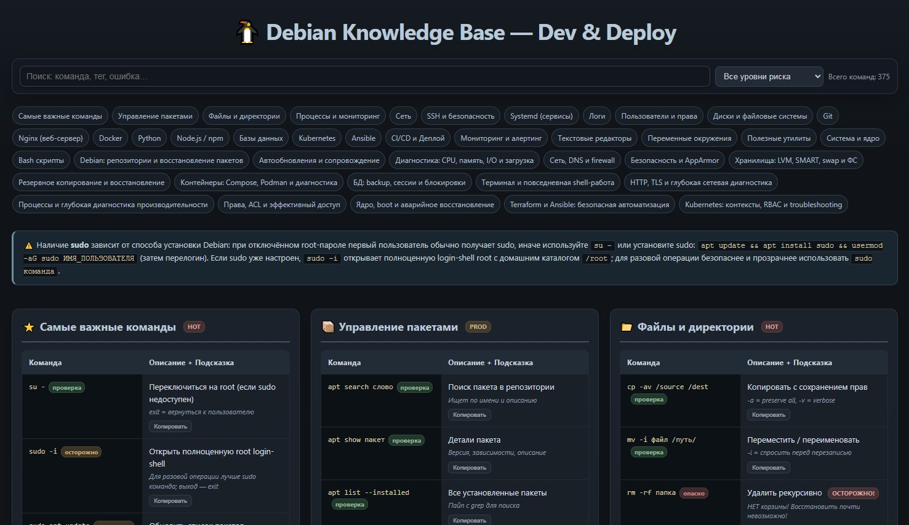

# 🐧 Debian Knowledge Base — Dev & Deploy

Автономная русскоязычная база знаний по Debian, разработке и эксплуатации: один HTML-файл без внешних зависимостей. Откройте `cheat_linux.html` в современном браузере — интернет и установка пакетов для самого справочника не нужны.

## Что внутри

- **41 раздел и 375 команд**: APT/dpkg, systemd, shell, сеть/TLS, Git, Docker/Compose v2, Python, Kubernetes, Ansible, Terraform, БД, ядро и Bash.
- Отдельные практические блоки: репозитории deb822/keyrings, pinning и backports, unattended upgrades, восстановление dpkg, CPU/RAM/I/O/OOM/boot troubleshooting, DNS и nftables, AppArmor, LVM/SMART/swap/fsck, Restic/Borg/rsync и восстановление БД.
- Поиск по командам, описаниям, скрытым подсказкам, тегам и русско-английским синонимам.
- Оглавление с ссылками на разделы, URL-якоря, счётчик результатов, empty state и очистка фильтров.
- Метки риска: «проверка», «осторожно», «опасно» и фильтр по ним.
- Кнопка копирования, доступные с клавиатуры подсказки (Enter/Space, Escape) и адаптивный интерфейс.
- Мягкая графитовая тема, спокойные статусы, цельный тёмный фон команд и favicon с пингвином.

## Важные принципы

- `sudo` в Debian зависит от варианта установки: при отключённом root-пароле установщик обычно настроит sudo для первого пользователя. В остальных случаях войдите через `su -` или установите `sudo` и добавьте пользователя в группу `sudo`.
- `sudo -i` открывает полноценную login-shell root с `HOME=/root`. Используйте её для серии административных действий, а для одной операции предпочитайте более прозрачное `sudo команда`.
- Для стороннего ПО не подключайте Ubuntu PPA к Debian. Используйте deb822-файлы в `/etc/apt/sources.list.d/`, отдельный keyring в `/etc/apt/keyrings/` и инструкции поставщика.
- Сначала используйте безопасные команды (`--dry-run`, `-c`, `-N`, `config --quiet`), читайте план, проверяйте backup восстановлением. Метка риска в справочнике не заменяет оценку контекста.
- Примеры содержат заполнители (`пакет`, `ИМЯ_ПОЛЬЗОВАТЕЛЯ`, `/dev/sdX`). Не вставляйте их буквально и всегда подтверждайте целевой сервер/диск/БД.

## Использование

1. Откройте `cheat_linux.html`.
2. Найдите нужную тему через строку поиска: например, `dns`, `бэкап`, `postgres`, `ошибка`, `docker`.
3. Нажмите на команду для подсказки или используйте кнопку «Копировать».
4. Для рискованных действий сначала прочитайте подсказку и выполните предложенную диагностическую проверку.

## Разработка

Проект намеренно остаётся простым: HTML, CSS и JavaScript находятся в одном файле. Счётчики разделов и команд рассчитываются в браузере, поэтому не требуют ручного обновления после добавления строк. При добавлении команды придерживайтесь формата существующей строки, добавляйте объяснение в `data-tip` и указывайте безопасную проверку, когда команда меняет систему или данные.
